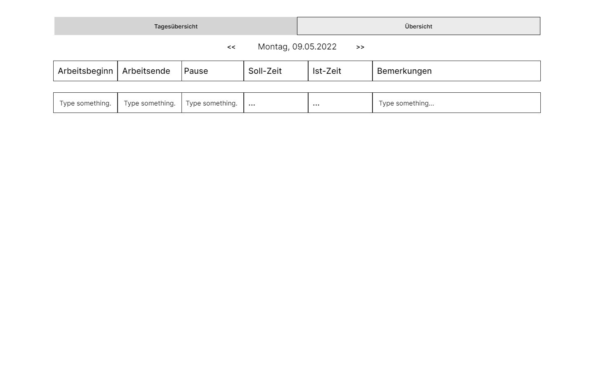

<div align="center">
<h3 align="center">Arbeitszeitnachweis</h3>
 
</div>


[](https://github.com/LokCenter/AZN_Spring_WebClient/graphs/commit-activity)

<!-- TABLE OF CONTENTS -->
<details>
  <summary>Table of Contents</summary>
  <ol>
    <li>
      <a href="#about-the-project">About The Project</a>
      <ul>
        <li><a href="#built-with">Built With</a></li>
      </ul>
    </li>
    <li>
      <a href="#getting-started">Getting Started</a>
      <ul>
        <li><a href="#prerequisites">Prerequisites</a></li>
        <li><a href="#installation">Installation</a></li>
      </ul>
    </li>
    <li><a href="#ci">CI</a></li>
    <li><a href="#roadmap">Roadmap</a></li>
    <li><a href="#collaborators">Collaborators</a></li>
    <li><a href="#contact">Contact</a></li>
  </ol>
</details>


<!-- ABOUT THE PROJECT -->
## About The Project



The project is used to manage timesheets

Other areas of application:

* User can access his time sheet from anywhere
* Easy management of vacation days, overtime and GLAZ
* Effortless viewing of holidays

### Built With

* [Spring Boot](https://spring.io/projects/spring-boot)
* [Spring Security](https://spring.io/projects/spring-security)
* [Thymeleaf](https://www.thymeleaf.org/)

<!-- GETTING STARTED -->
## Getting Started

### Prerequisites

* Java 17+
* Maven 3+

### Installation


1. Clone the repo
   ```sh
   git clone https://github.com/LokCenter/AZN_Spring.git
   ```
2. Build Project
   ```sh
   mvn spring-boot:run
   ```
## CI

This repo uses **GitHub Actions** 

### JUnit + Maven

After every change (commit) to this repo GitHub Action will run all JUnit tests. 

**Pass ✅**


**Failure 🚫**


> **⚠️ Warning**: Run all tests and pull incoming changes before running `git commit`


Current status:

[](https://github.com/LokCenter/AZN_Spring_WebClient/actions/workflows/maven.yml)
<!-- ROADMAP -->
## Roadmap

- [X] Create Basic Repo
- [X] Add Login Authentication 
  - [X] Add Login Page
  - [X] Use OAuth 2.0
  - [ ] Add Register Page (Optional)
- [X] Add DayPlan Page
- [X] Add Overview Page
- [X] Add Admin Page
  - [X] Add Admin Panel

## Collaborators
<ul>
  <li><a href="https://github.com/chfle">chfle</a> - <a href="mailto:christian.lehnert.home@protonmail.com">christian.lehnert.home@protonmail.com</a></li> 
  <li><a href="https://github.com/lszillat">lszillat</a> - <a href="mailto:leonard.szillat@gmail.com">leonard.szillat@gmail.com</a></li>
</ul>

<!-- CONTACT -->
## Contact

Christian Lehnert - [@ChrLehnert](https://twitter.com/ChrLehnert) - <a href="mailto:christian.lehnert.home@protonmail.com">christian.lehnert.home@protonmail.com</a>

<p align="right">(<a href="#top">back to top</a>)</p>
